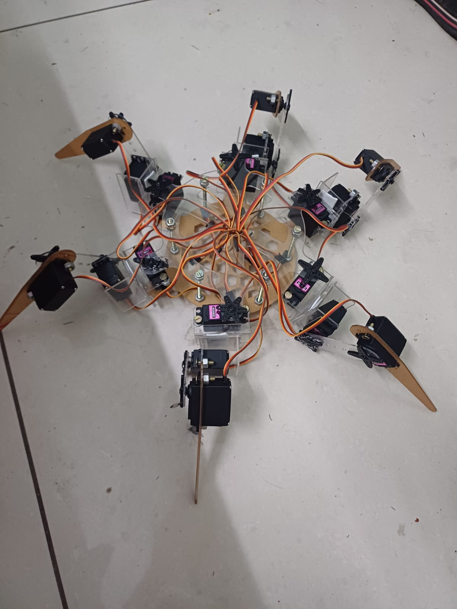
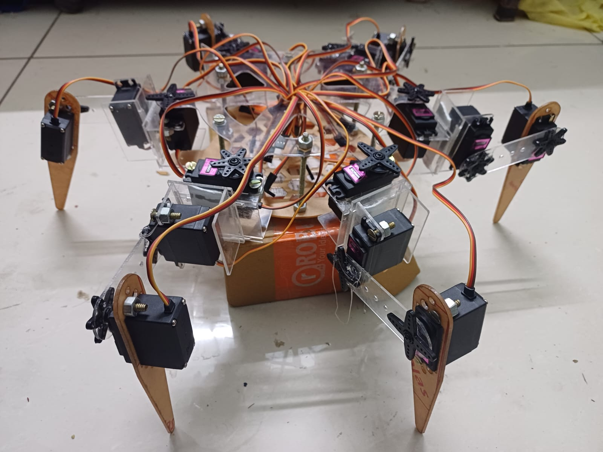
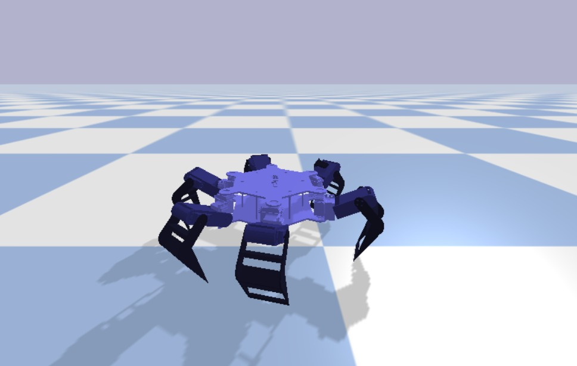

# HexaBot: Six-Legged Robot Simulation & Real-World Implementation





A custom six‑legged (hexapod) robot environment built in PyBullet and trained using Stable‑Baselines3 SAC. This repository contains both the simulation code and notes on the real‑world implementation using ESP32, a servo driver (PCA9685), and MG996R analog servos. Real prototype photos are in `images/1.jpg` and `images/2.jpg`, and the simulation screenshot is in `images/3.jpg`.

---

---

## Project Overview

HexaBot is a hexapod (six‑legged) robot designed for research in legged locomotion. The project comprises:

* **Simulation**: A PyBullet-based environment (`HexabotEnv`) wrapped as a Gym API, with a Soft Actor‑Critic (SAC) policy trained in Stable‑Baselines3.
* **Real‑World Implementation**: A physical prototype built from acrylic/mild steel parts, controlled by an ESP32 microcontroller driving MG996R servos via a PCA9685 servo driver.

---

---

## Repository Structure

```text
├── images/
│   ├── 1.jpg             # Real robot photo 1 (top view)
│   ├── 2.jpg             # Real robot photo 2 (side view)
│   └── 3.jpg             # Simulation screenshot
├── urdf/
│   └── Hexybot.urdf      # URDF model for simulation
├── SAC_walk.py           # Main simulation & training script
├── firmware/
│   ├── esp32_main.cpp    # ESP32 firmware source
├── requirements.txt      # Python dependencies
└── README.md             # This file
```


## Real‑World Hardware Setup

### Mechanical Design

* **Chassis**: Laser-cut acrylic body with six leg mounts.
* **Legs**: Two-joint laser-cut brackets and linkages.

### Electronics & Wiring

* **Microcontroller**: ESP32 development board.
* **Servo Driver**: PCA9685 16‑channel PWM (I2C).
* **Servos**: 18× MG996R analog hobby servos.
* **Power**: 5V, ≥10A LiPo battery, common ground with ESP32.

**Wiring Diagram**:

```
ESP32 I2C (SDA, SCL) --> PCA9685
PCA9685 channels 0–17 --> Servo signal wires
Battery 5V/GND       --> Servo Vcc/GND + ESP32 GND
```


